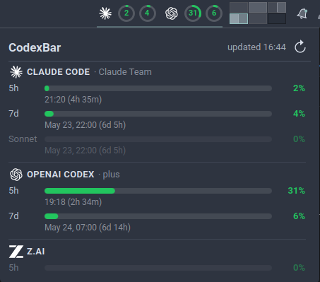

# CodexBar for KDE Plasma 6

A system-tray widget that lives inside your KDE panel — showing AI coding-provider
usage limits at a glance, and a full **Agent View** of every Claude, Codex, pi,
OpenCode, and omp session running on your machine. One click to jump straight to
the blocked one.

Linux port of the macOS [CodexBar](https://github.com/steipete/CodexBar) menu-bar app.



## What it does

**Usage tab** — Per-provider rate-limit meters with progress bars, percent used,
and reset countdowns. Supports Claude, Codex, z.ai, OpenRouter, and Kilo out of
the box.

**Agent View tab** — A real-time overview of every active coding-agent session on
your machine, grouped by project folder:

- **Live state tracking** — working (green), blocked/waiting for input (red),
  idle (grey), untracked (blue).
- **One-click focus** — click a session row (or press Enter with keyboard nav)
  and the widget activates the terminal window hosting that session via KWin
  scripting. Works with Kitty, Konsole, and other terminal emulators.
- **Folder grouping** — sessions clustered by project directory so you can scan
  at a glance.
- **Auto-tab** — the popup opens directly to Agents when `Super+A` is pressed,
  or when any agent is blocked.
- **Tray presence** — colored count dots (working/blocked/idle) beside the
  usage rings, optional featured-task label, and a red badge when agents need
  attention.

The aggregator scans `/proc` to discover running agent processes, reads their
session transcripts for window titles and last prompts, and writes a single
`~/.codexbar/agents.json` that the widget polls via XHR — no background daemon
required.

## Supported providers

| Provider       | Auth                                  | What it shows                                                     |
| -------------- | ------------------------------------- | ----------------------------------------------------------------- |
| **Claude**     | OAuth (`~/.claude/.credentials.json`) | 5h / 7d windows, plus Claude Design and Daily Routines quotas     |
| **Codex**      | OAuth (`~/.codex/auth.json`)          | 5h / weekly windows with reset countdowns                         |
| **z.ai**       | API key (`ZAI_API_KEY`)               | 5h and monthly windows                                            |
| **OpenRouter** | API key (`OPENROUTER_API_KEY`)        | Remaining balance; per-key allowance bar when a `keyLimit` is set |
| **Kilo**       | API key (`KILO_API_KEY`)              | Remaining credits balance                                         |

## Supported agent sessions

| Agent                         | Discovery method                                       |
| ----------------------------- | ------------------------------------------------------ |
| **Claude Code**               | `pgrep claude`, transcript parse from `~/.claude/`     |
| **OpenAI Codex CLI**          | `pgrep codex`, transcript parse from `~/.codex/`       |
| **OpenCode**                  | `pgrep opencode`, transcript parse                     |
| **pi / omp**                  | `pgrep -x pi`, JSONL rollout from `~/.pi/` or `~/.omp/` |

Sessions without a hook sentinel file are shown as "untracked" — still visible
with state and cwd, just no task title.

## Requirements

- KDE Plasma **6**
- The [`codexbar`](https://github.com/steipete/CodexBar) CLI installed and on
  your `PATH` (defaults to `~/.local/bin/codexbar`)
- Python 3 (already present on every Plasma 6 system)
- `kpackagetool6` (ships with Plasma 6)

## Install

```sh
git clone https://github.com/materemias/codexbar-kde
cd codexbar-kde
kpackagetool6 -t Plasma/Applet -i .
```

Then in Plasma:

1. Right-click the panel → **Enter Edit Mode** → **Add Widgets…**
2. Search for **CodexBar** and drag it onto the panel.
3. Open widget settings → **Agents** tab → click **Install** to set up the
   agent integration (XHR env scripts + `codexbar://` URL handler for
   click-to-focus).

The installed copy lives at `~/.local/share/plasma/plasmoids/org.codexbar.plasmoid/` —
it's a self-contained snapshot, so the source directory can live anywhere.

## Configure provider credentials

Plasmashell runs in its own environment, so API keys exported in `~/.zshrc` or
`~/.bashrc` are **invisible** to the plasmoid. The `codexbar` CLI reads
`~/.codexbar/config.json` and injects each provider's `apiKey` as the
appropriate env var before fetching — use this file for tokens the plasmoid
needs to see:

```json
{
  "version": 1,
  "providers": [
    {"id": "zai",  "enabled": true, "apiKey": "<from https://z.ai/manage-apikey/apikey>"},
    {"id": "kilo", "enabled": true, "apiKey": "<from app.kilo.ai>"}
  ]
}
```

Set permissions: `chmod 600 ~/.codexbar/config.json`.

Codex, Claude, and OpenRouter don't need entries here — they use their own
auth paths (`~/.codex/auth.json`, `~/.claude/.credentials.json`, and
`OPENROUTER_API_KEY` respectively).

## Update

```sh
cd /path/to/codexbar-kde
git pull
kpackagetool6 -t Plasma/Applet -u .
```

If files were deleted between versions, do a clean reinstall:

```sh
kpackagetool6 -t Plasma/Applet -r org.codexbar.plasmoid
kpackagetool6 -t Plasma/Applet -i .
```

## Uninstall

```sh
kpackagetool6 -t Plasma/Applet -r org.codexbar.plasmoid
```

## Restarting plasmashell

If the widget doesn't pick up changes (new env vars, deleted files, icon
caches), restart plasmashell:

```sh
plasmashell --replace
# or
kquitapp6 plasmashell && kstart plasmashell
```

## Configuration

Right-click the widget → **Configure CodexBar**. Four tabs:

### Backend
- Path to the `codexbar` CLI binary
- Usage polling interval (10s–15min)

### Providers
- Toggle individual providers on/off (Claude, Codex, z.ai, OpenRouter, Kilo)

### Tray
- Pick which (provider, window) meters to render as tray rings
- Indicator style: ring + percent, ring only, or percent only
- Icon and ring size (14–48px, capped by panel thickness)

### Agents
- Show/hide the Agents section in the popup
- Include untracked claude/codex processes (no hook sentinel)
- Show last user prompt under each session row
- Agent state refresh interval (2s–1min)
- Red badge when any agent is blocked
- Stacked colored count dots (working/blocked/idle) with adjustable size
- Close popup on focus loss
- **Integration** — Install/Remove/Check buttons for the XHR env scripts and
  `codexbar://` URL handler

## Keyboard shortcuts

| Shortcut  | Action                                           |
| --------- | ------------------------------------------------ |
| `Super+A` | Open popup and switch to Agents tab              |
| `↑` / `↓` | Navigate agent rows                              |
| `Enter`   | Focus the terminal hosting the selected session   |
| `Esc`     | Close the popup                                  |

## Layout

```
contents/
  config/main.xml              # KConfigXT schema (all settings keys)
  config/config.qml             # Settings tab definitions
  ui/main.qml                   # PlasmoidItem root, timers, helpers
  ui/CompactRepresentation.qml  # Tray: rings, state dots, topic label
  ui/FullRepresentation.qml     # Popup: tab bar (Usage / Agents)
  ui/ProviderSection.qml        # Per-provider usage section (Usage tab)
  ui/AgentsSection.qml          # Agent list with folder groups (Agents tab)
  ui/configBackend.qml          # Settings → Backend tab
  ui/configProviders.qml        # Settings → Providers tab
  ui/configTray.qml             # Settings → Tray tab
  ui/configAgents.qml           # Settings → Agents tab
  scripts/codexbar_fetch.py     # Parallel CLI invocation, merges JSON
  scripts/codexbar_agents.py    # Agent state aggregator (/proc scanner)
  scripts/codexbar_focus.py     # Click-to-focus: KWin + Kitty activation
  scripts/install_integration.py # One-shot: env scripts + URL handler + cleanup
  icons/*.svg                   # Per-provider icons
```

## License

MIT — see [`LICENSE`](LICENSE).

Third-party provider logos under `contents/icons/` are trademarks of their
respective owners, used solely for visual identification — see
[`NOTICE`](NOTICE) for attribution.
