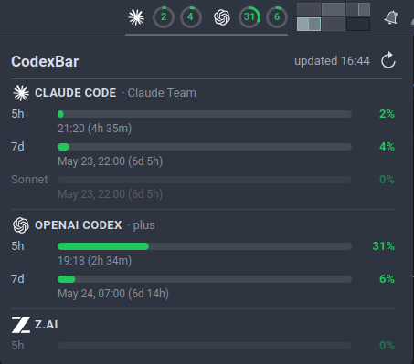

# CodexBar for KDE Plasma 6

A system-tray widget that lives inside your KDE panel — showing AI coding-provider
usage limits at a glance, and a full **Agent View** of every Claude, Codex, pi,
OpenCode, and omp session running on your machine. One click to jump straight to
the blocked one.

Linux port of the macOS [CodexBar](https://github.com/steipete/CodexBar) menu-bar app.



## What it does

**Usage tab** — Per-provider rate-limit meters with progress bars, percent used,
and reset countdowns. Supports Claude, Codex, z.ai, OpenCode Go, OpenRouter, and
Kilo out of the box.

Each meter carries a **pace tick**: a small marker showing where even
consumption would sit at this point in the window. A white tick ahead of the
fill means the current pace lasts until the reset; a red tick behind the fill's
end means the window will run out before it resets at this rate. Once a window
is 3% elapsed, its reset line shows a `proj N%` suffix — the projected usage at
reset if the current rate holds — and hovering a bar details the elapsed time,
pace, and when the meter would hit 100%. Before that the tick stays neutral and
no projection is shown, since the numbers are pure noise in the first minutes.
A reset timestamp that is past or outside the declared window is treated as
broken data and renders without a tick. Balance-only meters (OpenRouter limit,
Kilo credits) have no time window and never show the tick.

Countdowns and pace indicators update while the popup or tray tooltip is
visible, independently of the provider polling interval.

The popup header shows the version of the CodexBar CLI next to the title, read
from `codexbar --version` during the same fetch that collects usage. If the CLI
is missing or too old to report a version, the label hides and usage data is
unaffected.

**Manual refresh.** The refresh button in the popup header — or pressing `R`
while the popup is on the Usage tab — requests a fresh provider fetch and
agent scan immediately, without waiting for the polling interval. When a
provider is enabled, each request runs a new command rather than replaying a
cached source; a call that lands while a fetch is already in flight is
skipped. On the Agents tab, `r` types into the filter instead of refreshing.

**Codex saved resets.** Each Codex account's weekly (7d) row appends its
usable reset credits to the reset line, e.g. `· 2 saved resets · soonest
expires in 16d 8h (2026-10-04)`. Only credits with status `available` count;
the expiry shown is the earliest one. Accounts without credits show nothing.

**Codex reset forecast.** Below the last Codex account, the usage tab shows an
auxiliary forecast
from [codex-reset.com](https://codex-reset.com). It estimates the next reset
from the site's recent cadence and common reset window, not an exact timestamp.
The widget shows the estimate and time remaining in local 24 hour time,
along with short-horizon probabilities and confidence. When codex-reset.com
publishes an alert that is newer than the last recorded reset, its summary
appears on a second line so you can see why the next reset is coming. An alert
that only announces the reset already recorded stays hidden. The forecast is
optional and enabled by default. If codex-reset.com is unavailable, usage data
continues to work. Cached forecast data can be marked stale.
Forecast requests have an eight-second overall deadline and a 256 KiB response
limit. A timed-out request falls back to cached forecast data when available.

**Agent View tab** — A real-time overview of every active coding-agent session on
your machine, grouped by project folder:

- **Live state tracking** — working (green), blocked/waiting for input (red),
  idle (grey), untracked (blue).
- **One-click focus** — click a session row (or press Enter with keyboard nav)
  and the widget activates the terminal window hosting that session via KWin
  scripting. Works with Kitty, Konsole, and other terminal emulators.
- **Folder grouping** — sessions clustered by project directory, with newest
  sessions first within each project.
- **Desktop badges.** Each session row shows the number of the virtual
  desktop its terminal window is on. Sessions on the current desktop get a
  highlighted badge, so you can see which agent is one switch away. Windows
  pinned to all desktops show "all".
- **Restart recovery.** After a Linux boot change, unresolved sessions from
  the last sample appear in a separate restore list with their project,
  desktop, host, identifying text, and last-seen time. CodexBar shows a
  copyable resume command only when it can prove the exact provider session.
  It never launches recovery commands.
- **Conversation peek.** Click the arrow on a session row or press `Space` to
  expand its last eight user and assistant turns. Color-coded cards separate
  user, assistant, and tool turns.
  Selection and the expanded preview follow the same session when polling
  reorders the list.
- **Type-to-filter search.** Start typing on the Agents tab. The filter fuzzy
  matches the session title, last prompt, working directory, and provider.
  Recent conversation text uses exact case-insensitive substring matching.
- **Auto-tab.** The popup opens directly to Agents when `Super+A` is pressed,
  an agent is blocked, or restore records exist.
- **Tray presence** — colored count dots (working/blocked/idle) beside the
  usage rings, optional featured-task label, and a red badge when agents need
  attention.

The aggregator scans `/proc` to discover running agent processes and writes
`~/.codexbar/agents.json`. The widget reads it after each successful scan, with
at most one scan in flight per widget. No background daemon is required.
Private parser checkpoints in `~/.codexbar/agents.parsers.json`, mode `0600`,
retain session metadata and bounded recent turns across polls. Unchanged
transcripts need no parsing; changed files validate the consumed prefix and
parse only appended complete records. Rewrites, truncation, or file replacement
reset the checkpoint. Missing or invalid checkpoints rebuild automatically.
Both reader and writer use the current user's home directory, including homes
outside `/home` and system-wide applet installations.
At boot boundaries, the same file carries unresolved recovery records forward
until the matching provider session becomes live again.
Hiding the Agents tab does not stop polling while tray dots, the blocked badge,
or the task label remain enabled. Unidentified processes are classified as
untracked and can be excluded from both the list and its counts.

## Supported providers

| Provider       | Auth                                  | What it shows                                                     |
| -------------- | ------------------------------------- | ----------------------------------------------------------------- |
| **Claude**     | OAuth (`~/.claude/.credentials.json`) | 5h / 7d windows, plus Claude Design and Daily Routines quotas     |
| **Codex**      | OAuth (`~/.codex/auth.json`)          | Per-account 5h and weekly windows, plus Reserve 7d |
| **z.ai**       | API key (`ZAI_API_KEY`)               | 5h and monthly windows                                            |
| **OpenCode Go** | `apiKey` in `~/.codexbar/config.json` (your `opencode-go` key from `~/.local/share/opencode/auth.json`), else `OPENCODE_API_KEY`; falls back to a local estimate | 5h / 7d / monthly windows |
| **OpenRouter** | `apiKey` in `~/.codexbar/config.json`, else `OPENROUTER_API_KEY` | Remaining balance; per-key allowance bar when a `keyLimit` is set |
| **Kilo**       | `apiKey` in `~/.codexbar/config.json`, else `KILO_API_KEY` | Remaining credits balance                                         |

The Reserve 7d row is the separate weekly quota that the Codex CLI reports
for GPT models.

## Supported agent sessions

| Agent                         | Discovery method                                       |
| ----------------------------- | ------------------------------------------------------ |
| **Claude Code**               | `pgrep claude`, transcript parse from `~/.claude/`     |
| **OpenAI Codex CLI**          | `pgrep codex`, transcript parse from `~/.codex/`       |
| **OpenCode**                  | `pgrep opencode`, transcript parse                     |
| **pi / omp**                  | `pgrep -x pi`, JSONL rollout from `~/.pi/` or `~/.omp/` |

Sessions without a hook sentinel file are shown as "untracked" — still visible
with state and cwd, just no task title.

When a session source records the selected model, the short model name appears
beside the task title in an accent color. Rows without model metadata keep the
existing layout.

## Requirements

- KDE Plasma **6**
- The [`codexbar`](https://github.com/steipete/CodexBar) CLI installed. The
  default path is `/usr/bin/codexbar`, the entry point the `codexbar-cli`
  package installs, chosen over the `~/.local/bin/codexbar` symlink. It is a
  small `sh` wrapper that forwards to `/usr/lib/codexbar-cli/codexbar` and
  survives CLI upgrades, so leave the setting on it unless your install lives
  elsewhere.
- Python 3 (already present on every Plasma 6 system)
- `kpackagetool6` (ships with Plasma 6)

## Install

```sh
git clone https://github.com/materemias/codexbar-kde
cd codexbar-kde
kpackagetool6 -t Plasma/Applet -i .
```

Then in Plasma:

1. Right-click the panel → **Enter Edit Mode** → **Add Widgets…**
2. Search for **CodexBar** and drag it onto the panel.
3. Open widget settings → **Agents** tab → click **Install** to set up the
   agent integration (XHR env scripts + `codexbar://` URL handler for
   click-to-focus).

The installed copy lives at `~/.local/share/plasma/plasmoids/org.codexbar.plasmoid/` —
it's a self-contained snapshot, so the source directory can live anywhere.

## Configure provider credentials

Plasmashell runs in its own environment, so API keys exported in `~/.zshrc` or
`~/.bashrc` are invisible to the plasmoid. The `codexbar` CLI reads
`~/.codexbar/config.json` and injects each provider's `apiKey` before fetching.
The same file can list additional Codex profile homes:

```json
{
  "version": 1,
  "providers": [
    {"id": "codex", "enabled": true, "codexProfileHomePaths": ["~/.codex-pro"]},
    {"id": "zai",   "enabled": true, "apiKey": "<from https://z.ai/manage-apikey/apikey>"},
    {"id": "opencodego", "enabled": true, "apiKey": "<your opencode-go key, see ~/.local/share/opencode/auth.json>"},
    {"id": "kilo",  "enabled": true, "apiKey": "<from app.kilo.ai>"},
    {"id": "openrouter", "enabled": true, "apiKey": "<management key from https://openrouter.ai/settings/keys>"}
  ]
}
```

Set permissions: `chmod 600 ~/.codexbar/config.json`.

The default Codex account needs no config entry. It uses `~/.codex/auth.json`.
To add another subscription, authenticate a separate Codex home and list it in
`codexProfileHomePaths`:

```sh
mkdir -p ~/.codex-pro
CODEX_HOME=~/.codex-pro codex login
```

Claude uses `~/.claude/.credentials.json`.

OpenRouter reads `apiKey` from the config file, falling back to the
`OPENROUTER_API_KEY` environment variable. The key must be a management key,
because `GET /api/v1/credits` rejects a plain inference key with HTTP 403
("Only management keys can fetch credits for an account"). The optional 30 day
spend row needs `OPENROUTER_MANAGEMENT_API_KEY` in the environment, which the
config file cannot supply.

The balance in the row header is the remaining credit from the CLI's credits
output, so it appears whenever the key can read credits. A usage bar appears
only when the key has a per-key spend limit set on OpenRouter.

## Troubleshooting

### "Kilo CLI session file is invalid ... run `kilo login`"

Running `kilo login` does not fix this one. The message is the CodexBar CLI
falling back to the Kilo session file after finding no API key, and the two
tools disagree about that file's shape: `kilo` writes the token as
`kilo.key` in `~/.local/share/kilo/auth.json`, while CodexBar looks for
`kilo.access`. A fresh login rewrites `kilo.key` and changes nothing.

Do not hand-edit `~/.local/share/kilo/auth.json`. Add a `kilo` provider
`apiKey` to `~/.codexbar/config.json` as shown above. This keeps CodexBar on
the API path. With the key present the provider reports `source: "api"`;
without it, and with `KILO_API_KEY` unset, the same misleading session-file
error comes back.

## Update

```sh
cd /path/to/codexbar-kde
git pull
kpackagetool6 -t Plasma/Applet -u .
```

If files were deleted between versions, do a clean reinstall:

```sh
kpackagetool6 -t Plasma/Applet -r org.codexbar.plasmoid
kpackagetool6 -t Plasma/Applet -i .
```

## Uninstall

```sh
kpackagetool6 -t Plasma/Applet -r org.codexbar.plasmoid
```

## Restarting plasmashell

If the widget doesn't pick up changes (new env vars, deleted files, icon
caches), restart plasmashell:

```sh
plasmashell --replace
# or
kquitapp6 plasmashell && kstart plasmashell
```

Manual restarts inherit the locale of the launching shell. To keep Hungarian
24-hour time formatting in the popup, restart from your session shell with:

```sh
kquitapp6 plasmashell \
  && env LANG=hu_HU.utf8 LC_ALL=hu_HU.utf8 LC_TIME=hu_HU.utf8 \
       kstart plasmashell
```

## Configuration

Right-click the widget → **Configure CodexBar**. Four tabs:

### Backend
- Path to the `codexbar` CLI binary (default `/usr/bin/codexbar`). Custom paths,
  including spaces and shell-special characters, are passed literally. The same
  setting controls normal polling and Codex account discovery in Tray settings.
- Usage polling interval (10–3600 seconds)

### Providers
- Toggle individual providers on/off (Claude, Codex, z.ai, OpenCode Go, OpenRouter, Kilo)
- In the Providers tab, toggle the Codex reset forecast with
  `showCodexResetForecast` (enabled by default)

### Tray
- Pick meters per Codex account and per rate window
- Pick provider and window meters for Claude, z.ai, OpenCode Go, OpenRouter, and Kilo
- Per meter, "only if proj > 100%" hides the tray indicator while the window is
  on pace to last until its reset (projection as in the popup's `proj N%`);
  it reappears once the current rate would exceed 100%. Meters whose window
  cannot be projected yet (under 3% elapsed, no reset time) stay hidden too.
  The provider icon disappears along with its last visible meter.
- Indicator style: ring + percent, ring only, or percent only
- Icon and ring size (14–48px, capped by panel thickness)

### Agents
- Show/hide the Agents section in the popup
- Include untracked processes without a resolved provider session
- Show last user prompt under each session row
- Agent state refresh interval (2–120 seconds)
- Red badge when any agent is blocked
- Stacked colored count dots (working/blocked/idle) with adjustable size
- Optional task label in horizontal panels, with adjustable maximum width
- Close popup on focus loss
- **Integration** — Install/Remove/Check buttons for the XHR env scripts and
  `codexbar://` URL handler

## Keyboard shortcuts

| Shortcut         | Action                                             |
| ---------------- | -------------------------------------------------- |
| `Super+A`        | Open popup and switch to Agents tab                |
| `↑` / `↓`        | Navigate agent rows; an open preview follows selection |
| `Enter`          | Focus the terminal hosting the selected session    |
| `Space`          | Expand or collapse the selected conversation peek  |
| `R`              | Refresh usage (Usage tab only; `r` filters on Agents) |
| Printable text   | Filter sessions on the Agents tab                   |
| `Backspace`      | Edit the active filter                              |
| `Esc`            | Clear the active filter, then close the popup       |

## Layout

```
contents/
  config/main.xml              # KConfigXT schema (all settings keys)
  config/config.qml             # Settings tab definitions
  ui/main.qml                   # PlasmoidItem root, timers, helpers
  ui/CompactRepresentation.qml  # Tray: rings, state dots, topic label
  ui/FullRepresentation.qml     # Popup: header (title, CLI version), tab bar
  ui/ProviderSection.qml        # Per-provider usage section (Usage tab)
  ui/AgentsSection.qml          # Agent list with folder groups (Agents tab)
  ui/configBackend.qml          # Settings → Backend tab
  ui/configProviders.qml        # Settings → Providers tab
  ui/configTray.qml             # Settings → Tray tab
  ui/configAgents.qml           # Settings → Agents tab
  scripts/codexbar_fetch.py     # Parallel CLI invocation, merges JSON
  scripts/codexbar_agents.py    # Agent state aggregator (/proc scanner)
  scripts/codexbar_focus.py     # Click-to-focus: KWin + Kitty activation
  scripts/install_integration.py # One-shot: env scripts + URL handler + cleanup
  icons/*.svg                   # Per-provider icons
```

## License

MIT — see [`LICENSE`](LICENSE).

Third-party provider logos under `contents/icons/` are trademarks of their
respective owners, used solely for visual identification — see
[`NOTICE`](NOTICE) for attribution.
