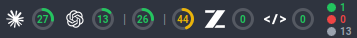
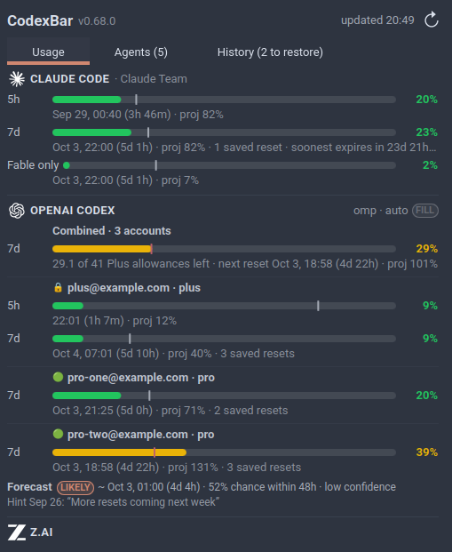
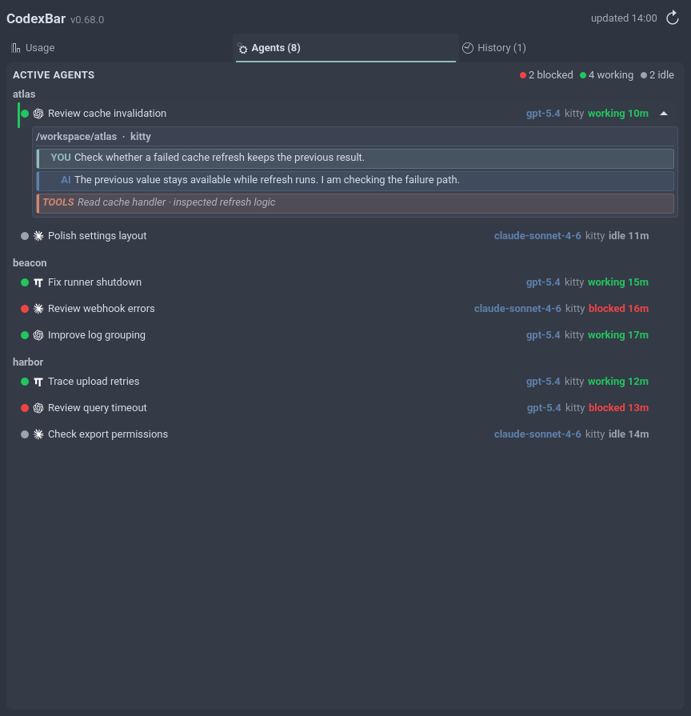
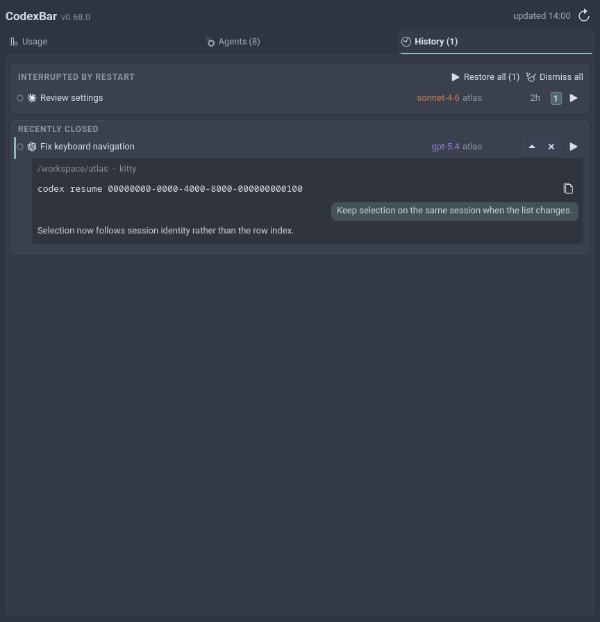

# CodexBar for KDE Plasma 6

**Never lose track of an agent again.**

You run a handful of coding agents across several monitors and desktops. One
is waiting for your answer, two just finished, and your weekly limit is closer
than you think. Then a crash takes every terminal down with it. CodexBar keeps
all of that in your Plasma panel:

- **No surprise limits.** Every account's usage in one place, with pace
  ticks and projections that warn you before a limit hits, not after.
- **Who needs you, at a glance.** Panel dots count working, blocked and
  idle agents, so you see a session waiting for input without looking for it.
- **Find any session by typing.** Every Claude Code, Codex, OpenCode, pi
  and omp session running in a terminal or T3 Code, filtered as you type, with a peek at
  its last messages.
- **Jump straight to it.** One click switches to the right desktop and
  raises the session's terminal, whichever monitor it is on.
- **Never leave the keyboard.** `Super+A` opens the agent list, typing
  fuzzy-finds a session, `↑`/`↓` select it, `Space` peeks and `Enter` jumps
  to its terminal.
- **Get it all back.** After a reboot or crash, **Restore all** reopens your
  kitty sessions, each in its own window on the desktop it ran on. Closed one
  by mistake? Find it in History and bring it back with one click.

It started as a Linux port of the macOS
[CodexBar](https://github.com/steipete/CodexBar) menu-bar app and uses its
`codexbar` CLI for usage data.

[Requirements](#requirements) · [Install](#install) ·
[Keyboard shortcuts](#keyboard-shortcuts) · [Features](#features) ·
[Supported providers](#supported-providers) · [Supported agents](#supported-agent-sessions) ·
[Credentials](#configure-provider-credentials) · [Configuration](#configuration) ·
[Update](#update)

**Panel:** usage rings per provider and window, coloured by pace, and dots
counting working, blocked and idle agents.

[](docs/panel.png)

| Usage | Agents | History |
| :---: | :---: | :---: |
| [](docs/usage.png) | [](docs/agents.png) | [](docs/history.png) |

The popup screenshots use made-up accounts and sessions.
Drag the popup's edges to resize it within the available screen space.

## Requirements

| Requirement | Needed for |
| --- | --- |
| KDE Plasma **6** (with KWin) | Everything |
| Python 3 | Everything (bundled with Plasma 6 systems) |
| CMake 3.21+, a C++17 compiler, Qt 6 Core/QML development files | Building. On Arch: `base-devel`, `cmake`, `qt6-declarative` |
| [`codexbar`](https://github.com/steipete/CodexBar) CLI | Usage tab and tray rings. Without it, Agents and History still work |
| `qdbus6` (Plasma's Qt tools) | *Optional:* click to focus and desktop switching |
| kitty | *Optional:* **Launch** and **Restore all**. Other terminals keep the copyable resume command |
| systemd user session | *Optional:* **Launch**, so restored terminals survive a plasmashell restart |
| kitty remote control (`allow_remote_control`, `listen_on`) | *Optional:* faster, exact focus of kitty windows. KWin is used otherwise |
| `notify-send` (libnotify) | *Optional:* desktop usage warnings and agent waiting-for-input notifications |

The `codexbar` CLI path defaults to `/usr/bin/codexbar`, which is what the
Arch `codexbar-cli` package installs. Set another path in Settings → Backend.

## Install

1. Build and install the widget. The package contains a small native plugin,
   so build it on the machine that runs it:

   ```sh
   git clone https://github.com/materemias/codexbar-kde
   cd codexbar-kde
   cmake -S . -B build
   cmake --build build
   kpackagetool6 -t Plasma/Applet -i build/package
   ```

   Install `build/package`, not the source directory. The installed copy lives
   in `~/.local/share/plasma/plasmoids/org.codexbar.plasmoid/`, so the source
   checkout can be moved or deleted afterwards.

2. Add it to a panel: right-click the panel → **Enter Edit Mode** →
   **Add Widgets…**, search for **CodexBar**, and drag it onto the panel.

3. Enable the agent integration: widget settings → **Agents** → **Install**.
   This lets the widget read `~/.codexbar/agents.json` and registers the
   `codexbar://` handler used by click to focus. Agents and History stay empty
   until it is installed and plasmashell has been restarted once (see
   [Restarting plasmashell](#restarting-plasmashell)).

4. [Configure credentials](#configure-provider-credentials) for any provider
   beyond Claude and Codex.

## Keyboard shortcuts

| Shortcut         | Action                                                        |
| ---------------- | ------------------------------------------------------------- |
| `Super+A`        | Open the popup on the Agents tab                              |
| `←` / `→`        | Switch tabs                                                   |
| `↑` / `↓`        | Move the selection on Agents or History; an open peek follows |
| `Space`          | Open or close the selected row's peek                         |
| `Enter`          | Agents: focus the session's terminal. History: launch it      |
| `R`              | Refresh (Usage tab only; elsewhere `r` types into the filter) |
| Printable text   | Filter the Agents and History tabs                            |
| `Backspace`      | Edit the active filter                                        |
| `Esc`            | Clear the active filter, then close the popup                 |

## Features

### Usage tab

- **Provider meters.** Rate-limit bars with percent used and reset countdowns
  for Claude, Codex, z.ai, OpenCode Go, OpenRouter, Kilo and TypeSafe. Balance
  providers (OpenRouter, Kilo, TypeSafe) show what is left instead of a bar.
- **Pace.** Each windowed bar has a tick where even use would sit right now.
  A white tick ahead of the fill means the current pace lasts until the reset;
  a red tick behind it means the window runs out first. From 3% into the
  window, the reset line adds `proj N%`, the usage at reset if the current
  rate holds, and hovering a bar shows elapsed time, pace, and when it would
  hit 100%. Broken reset times (in the past or outside the window) get no tick.
- **Pace colours.** Bars and tray rings stay green while usage is at or under
  the tick, whatever the percentage. Past the tick they turn yellow, then
  orange at one third and red at two thirds of the way to 100%. Four hours into
  a 5h window the tick is at 80%: 79% is green, 81% yellow, 87% orange, 94% red.
  Bars without a pace use fixed thresholds: yellow from 50%, orange from 70%,
  red from 90%.
- **Codex accounts.** All Codex accounts sit under one `OPENAI CODEX` header,
  each with its email and plan. With two or more accounts, a combined bar pools
  their allowances in Plus units (Plus is 1, Pro is 20). Its tick is the
  allowance-weighted average of elapsed time, so accounts about to reset pull
  it forward, and its reset line shows allowances left and the next reset, for
  example `12.9 of 41 Plus allowances left · next reset Sep 26, 11:01 (1d 1h)`.
  The 7d combined bar is on by default, the 5h one off.
- **Recent usage.** 7d bars highlight the share used in the last 24 hours as a
  brighter tail of the fill, and 5h bars the last hour, with the figure in
  grey under the bar's right end, e.g. `13% in last 24h`. A reset inside that
  time counts the new window's usage in full, so the figure can exceed the
  current fill (the whole fill is then highlighted). It counts what was
  observed: a change across one poll that spans the lookback start counts in
  full, and a change across a polling pause of over 15 minutes that spans it is
  left out, since it can't be placed on either side. The combined Codex bar
  pools it in Plus units like its fill. History starts with the first poll
  after install, is
  kept as run-length samples (one entry per change, or per gap over 15
  minutes) in `~/.codexbar/usage_cache.json`, pruned to 24 hours, and
  survives restarts. Toggle it with `showRecentUsage` in Settings → Providers.
- **Codex 5h window.** A Codex weekly reset also resets the 5h window, so when
  the weekly reset comes first, the 5h row ends there and its pace spans the
  shortened window. Claude's weekly rollover leaves the 5h session alone.
- **Saved resets.** Claude and each Codex account show their usable reset
  credits on the weekly row, e.g. `· 2 saved resets · soonest expires in 16d
  8h`. For Claude this comes from Anthropic's usage API with the token in
  `~/.claude/.credentials.json`; a failed request just hides it.
- **Account rotation indicator.** Needs the omp Codex account rotation, a
  custom omp plugin that is not released yet. It spreads traffic across
  several Codex accounts and decides which may be used; the Codex header then
  shows its mode and each account shows 🟢 when open to rotation or 🔒 when
  held back. Without the plugin, nothing is shown.
- **omp mode notifications.** With rotation status available, a mode change
  sends a desktop alert containing the previous and new modes, for example
  `auto · FILL → auto · TARGET`. Changes between `auto` and `confirm`, or
  entering/leaving `STALLED`, are included. The first reading and the first
  reading after status becomes available again are silent. Enabled by
  default in Settings → Providers, independently of usage warnings.
- **Codex reset forecast.** An optional line from
  [codex-reset.com](https://codex-reset.com) under the Codex accounts:
  `ANNOUNCED` with the announcement, `LIKELY` with an estimated time and its
  chance within 48h, or `UNKNOWN` with how long the wait has been against
  recent gaps. Open Codex incidents and the latest hint appear below it. If the
  site is down, usage data is unaffected.
- **Refresh.** The header button, or `R` on the Usage tab, fetches usage and
  rescans agents immediately. The header also shows the `codexbar` CLI version.
- **Last-known usage.** Recent usage appears from a local cache before the
  first network refresh, and stays visible when a provider refresh fails.
  Cached rows say `Last known` with the measurement time and any refresh
  error. Their bars are muted, with no live pace projection or reset
  countdown. Records expire after 24 hours. The cache contains normalized
  display data, not credentials, in `~/.codexbar/usage_cache.json` with mode
  `0600`. The helper rechecks the CLI path, configuration and account inputs
  before restoring cached data; unverifiable data is cleared. Codex token
  refreshes and rotation among the same configured accounts preserve the cache.
- **Desktop usage warnings.** Enabled by default in Settings → Providers.
  Alerts fire at 80% and 95% used, or earlier when the pace projects
  exhaustion before reset once at least 10% is used, so the first prompt of a
  fresh window stays quiet. Each account and window is tracked separately;
  repeated polls do not repeat a delivered warning, but a higher severity
  can alert again. Cached readings and combined bars never generate alerts.
  Failed delivery retries on a later poll. OpenRouter's monthly key limit
  rearms at the UTC month boundary. Windows without a reset time rearm when
  a fresh reading falls below 80%. Changed account credentials start a separate
  alert history. Alerts name the account by email, for example
  `Codex · me@example.com · 7d`. After an applet restart, the first fresh high
  reading can alert again.
- **Notification timeout.** All CodexBar desktop notifications close after 10
  seconds and stay in the notification history. They are sent at normal
  urgency, since Plasma never closes critical ones on its own.

### Agents tab

- **Live sessions.** Every Claude Code, Codex, OpenCode, pi and omp session in
  a terminal, grouped by project folder, newest first. Each row shows the task
  title, model, terminal, state and how long it has been in it: working
  (green), blocked on your input (red), idle (grey), or untracked (blue) when
  the process has no resolvable session. Freshly idle rows pulse for five
  minutes.
- **Desktop badges.** The number of the virtual desktop the session's window
  is on, highlighted when it is the current one.
- **Click to focus.** Clicking a row, or `Enter`, raises the terminal hosting
  the session, switching desktop if needed.
- **Conversation peek.** The arrow or `Space` expands the last eight user,
  assistant and tool turns.
- **Type to filter.** Typing filters by title, prompt, folder, provider and
  model (fuzzy), and by recent conversation text (exact). Matching lines
  appear under the row with the query highlighted.
- **Waiting-for-input alerts.** Optional in Settings → Agents, off by default.
  A desktop notification appears when a tracked session changes to blocked.
  Opening the applet or enabling alerts does not notify for sessions already
  blocked. Notifications omit session titles, prompts and paths.

### History tab

- **Interrupted by restart.** After a reboot, every session from the last scan
  before it, ordered by desktop. They stay until the session runs again.
- **Recently closed.** The 100 most recent sessions that exited during this
  boot, as compact rows with a peek of their last turns.
- **Restore.** Each row has a copyable resume command, shown only when the
  exact provider session is known. Sessions that ran in kitty also get
  **Launch**: CodexBar switches to the saved desktop, opens a new kitty window
  there and resumes the session in your shell. **Restore all** does this for
  every restart row in desktop order, one at a time. Running sessions are never
  launched twice, and a row leaves History once its session is live again.
- **Dismiss.** ✕ removes a row; **Dismiss all** clears the restart rows shown.
- **Keyboard and filter.** `Up`/`Down` select, `Space` peeks, `Enter`
  launches, and typing filters like on the Agents tab.

### Panel

- Usage rings per provider and window, coloured by pace, optionally shown only
  when a window is projected to run out.
- Coloured dots counting working, blocked and idle agents, a red badge when an
  agent is blocked, and an optional label with the current task.
- `Super+A` opens the popup on Agents. The popup also opens on Agents when an
  agent is blocked, and on History when sessions wait to be restored.

### How agents are found

A helper script scans `/proc` for agent processes on every poll, reads their
session transcripts, and writes `~/.codexbar/agents.json`. No daemon or agent
hooks are needed. Parsed transcript state is cached in
`~/.codexbar/agents.parsers.json` (mode `0600`), so unchanged transcripts are
not reparsed. Polling continues while the tray dots, badge or task label are
enabled, even with the Agents tab hidden.

## Supported providers

These are the providers already integrated and tested in this applet, largely
the ones I use myself. The list is not a limit on what the applet can support:
other providers supported by the CodexBar CLI on Linux are generally
straightforward to add.

| Provider       | Auth                                  | What it shows                                                     |
| -------------- | ------------------------------------- | ----------------------------------------------------------------- |
| **Claude**     | OAuth (`~/.claude/.credentials.json`) | 5h / 7d windows, plus Claude Design and Daily Routines quotas     |
| **Codex**      | OAuth (`~/.codex/auth.json`)          | Per-account 5h and weekly windows, plus Reserve 7d |
| **z.ai**       | API key (`ZAI_API_KEY`)               | 5h and monthly windows                                            |
| **OpenCode Go** | `apiKey` in `~/.codexbar/config.json` (your `opencode-go` key from `~/.local/share/opencode/auth.json`), else `OPENCODE_API_KEY`; falls back to a local estimate | 5h / 7d / monthly windows |
| **OpenRouter** | `apiKey` in `~/.codexbar/config.json`, else `OPENROUTER_API_KEY` | Remaining balance; per-key allowance bar when a `keyLimit` is set |
| **Kilo**       | `apiKey` in `~/.codexbar/config.json`, else `KILO_API_KEY` | Remaining credits balance                                         |
| **TypeSafe**   | Console session `cookieHeader` in `~/.codexbar/config.json` (`cookieSource: "manual"`); off by default | Remaining credit balance; spend, plan, and credit expiry in details |

The Reserve 7d row is the separate weekly quota that the Codex CLI reports
for GPT models.

## Supported agent sessions

| Agent                         | Discovery method                                       |
| ----------------------------- | ------------------------------------------------------ |
| **Claude Code**               | `pgrep claude`, `~/.claude/sessions/<pid>.json` and the project transcript |
| **OpenAI Codex CLI**          | `pgrep codex`, rollout under the process's `CODEX_HOME` (default `~/.codex`), title from `session_index.jsonl` |
| **OpenCode**                  | `pgrep opencode`, session database                     |
| **pi / omp**                  | `pgrep -x pi` / `omp`, JSONL rollout from `~/.pi/` or `~/.omp/` |

A resume command is offered only when the exact session is known. Codex
sessions under a non-default `CODEX_HOME` resume with it set, e.g.
`CODEX_HOME=~/.codex-work codex resume <id>`. Two cases stay untracked
because one terminal does not map to one session: Claude Code's agent view
(plain `claude` opening the "describe a task" screen), whose tasks run as
background sessions of `claude daemon`, and Codex's Agent Command Center
after switching to another thread.

Sessions are recognised in kitty, Konsole, WezTerm, Alacritty, Ghostty, foot,
GNOME Terminal, Tilix, Yakuake, xterm, tmux and VS Code terminals. Claude
and Codex threads that T3 Code runs are listed too, with T3 Code as the host.
Clicking one raises the T3 Code window and sends it the thread's
`t3code://threads/<environment>/<thread>` link. T3 Code 0.0.44 ignores the
thread part, so the thread opens only once
[pingdotgg/t3code#9745](https://github.com/pingdotgg/t3code/issues/9745) is
fixed. History cannot relaunch them, but it shows the resume command.
When T3 Code stops a thread's provider session, its row moves to History even
though the thread stays in T3 Code. A process
whose session cannot be identified is listed as untracked, with its state and
folder but no title; Settings → Agents can hide these.

## Configure provider credentials

Plasmashell runs in its own environment, so API keys exported in `~/.zshrc` or
`~/.bashrc` are invisible to the plasmoid. The `codexbar` CLI reads
`~/.codexbar/config.json` and injects each provider's `apiKey` before fetching.
The same file can list additional Codex profile homes:

```json
{
  "version": 1,
  "providers": [
    {"id": "codex", "enabled": true, "codexProfileHomePaths": ["~/.codex-pro"]},
    {"id": "zai",   "enabled": true, "apiKey": "<from https://z.ai/manage-apikey/apikey>"},
    {"id": "opencodego", "enabled": true, "apiKey": "<your opencode-go key, see ~/.local/share/opencode/auth.json>"},
    {"id": "kilo",  "enabled": true, "apiKey": "<from app.kilo.ai>"},
    {"id": "openrouter", "enabled": true, "apiKey": "<management key from https://openrouter.ai/settings/keys>"},
    {"id": "typesafe", "enabled": true, "cookieSource": "manual", "cookieHeader": "<Cookie: header copied from https://console.typesafe.ai/settings/billing>"}
  ]
}
```

Set permissions: `chmod 600 ~/.codexbar/config.json`.

The default Codex account needs no config entry. It uses `~/.codex/auth.json`.
To add another subscription, authenticate a separate Codex home and list it in
`codexProfileHomePaths`:

```sh
mkdir -p ~/.codex-pro
CODEX_HOME=~/.codex-pro codex login
```

Claude uses `~/.claude/.credentials.json`.

OpenRouter reads `apiKey` from the config file, falling back to the
`OPENROUTER_API_KEY` environment variable. The key must be a management key,
because `GET /api/v1/credits` rejects a plain inference key with HTTP 403
("Only management keys can fetch credits for an account"). The optional 30 day
spend row needs `OPENROUTER_MANAGEMENT_API_KEY` in the environment, which the
config file cannot supply.

The balance in the row header is the remaining credit from the CLI's credits
output, so it appears whenever the key can read credits. A usage bar appears
only when the key has a per-key spend limit set on OpenRouter.

TypeSafe (CodexBar CLI 0.64.0 or newer) has no usage API; the CLI reads the
console's billing page with your browser session. Browser cookie import is
macOS-only, so on Linux set `cookieSource` to `manual` and paste the full
`Cookie:` request header from a signed-in
`https://console.typesafe.ai/settings/billing` request (browser dev tools,
Network tab). The session expires eventually; the row then shows "TypeSafe
session expired" until you paste a fresh header. TypeSafe reports no rate
window, so it has no tray meter; enable it in Settings → Providers.

## Configuration

Right-click the widget → **Configure CodexBar**. Four tabs:

### Backend
- Path to the `codexbar` CLI binary (default `/usr/bin/codexbar`). Custom paths,
  including spaces and shell-special characters, are passed literally. The same
  setting controls normal polling and Codex account discovery in Tray settings.
- Usage polling interval (10–3600 seconds)

### Providers
- Toggle individual providers on/off (Claude, Codex, z.ai, OpenCode Go, OpenRouter, Kilo, TypeSafe; TypeSafe is off by default)
- In the Providers tab, toggle the Codex reset forecast with
  `showCodexResetForecast` (enabled by default)
- Desktop usage warnings (`usageNotifications`, enabled by default)
- omp mode-change alerts (`ompModeNotifications`, enabled by default).
  Requires available status from the custom omp rotation plugin.
- Recent-usage tail and figure on 7d (last 24h) and 5h (last 1h) bars
  (`showRecentUsage`, enabled by default)

### Tray
- Pick meters per Codex account and per rate window
- Pick provider and window meters for Claude, z.ai, OpenCode Go, OpenRouter, and Kilo
- Per meter, "only if proj > 100%" hides the tray indicator while the window is
  on pace to last until its reset (projection as in the popup's `proj N%`);
  it reappears once the current rate would exceed 100%. Meters whose window
  cannot be projected yet (under 3% elapsed, no reset time) stay hidden too.
  The provider icon disappears along with its last visible meter.
- Indicator style: ring + percent, ring only, or percent only
- Icon and ring size (14–48px, capped by panel thickness)

### Agents
- Show/hide the Agents section in the popup
- Include untracked processes without a resolved provider session
- Show last user prompt under each session row
- Agent state refresh interval (2–120 seconds)
- Red badge when any agent is blocked
- Stacked colored count dots (working/blocked/idle) with adjustable size
- Optional task label in horizontal panels, with adjustable maximum width
- Close popup on focus loss
- Desktop waiting-for-input alerts (`agentNotifications`, off by default).
  Agent polling continues with alerts enabled even if agent indicators are hidden.
- Install, remove or check the agent integration's XHR env scripts and
  `codexbar://` URL handler.

## Update

```sh
cd /path/to/codexbar-kde
git pull
cmake -S . -B build
cmake --build build
systemctl --user stop plasma-plasmashell.service
kpackagetool6 -t Plasma/Applet -u build/package
systemctl --user start plasma-plasmashell.service
```

Plasma has to be stopped before the native plugin is replaced. `systemctl
--user stop` waits until plasmashell has exited; `kquitapp6` returns earlier,
and an immediate restart can then leave the panel down.

If files were deleted between versions, do a clean reinstall:

```sh
systemctl --user stop plasma-plasmashell.service
kpackagetool6 -t Plasma/Applet -r org.codexbar.plasmoid
kpackagetool6 -t Plasma/Applet -i build/package
systemctl --user start plasma-plasmashell.service
```

## Uninstall

```sh
kpackagetool6 -t Plasma/Applet -r org.codexbar.plasmoid
```

Settings → Agents → **Remove** first if you installed the agent integration.

## Restarting plasmashell

If the widget doesn't pick up changes (new environment, deleted files, icon
caches), restart plasmashell through systemd:

```sh
systemctl --user restart plasma-plasmashell.service
```

This keeps the session's environment and locale, including the time format
the popup uses. `plasmashell --replace` or `kstart plasmashell` from a terminal
inherit that terminal's environment instead.

## License

MIT. See [`LICENSE`](LICENSE).

Third-party provider logos under `contents/icons/` are trademarks of their
respective owners, used solely for visual identification. See
[`NOTICE`](NOTICE) for attribution.
